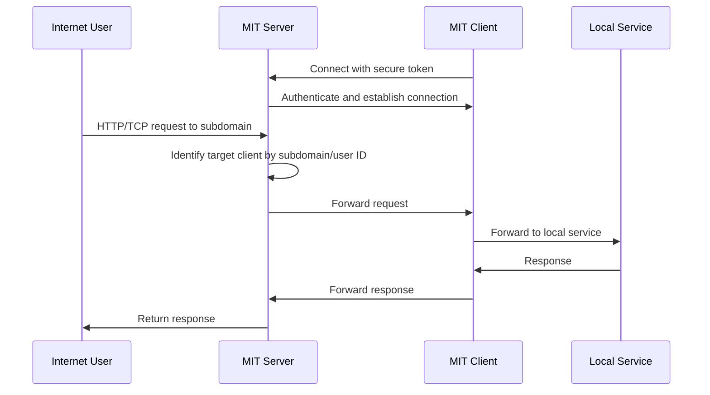

# Make It Public

[](https://github.com/ksysoev/make-it-public/actions/workflows/tests.yml)
[](https://codecov.io/gh/ksysoev/make-it-public)
[](https://goreportcard.com/report/github.com/ksysoev/make-it-public)
[](https://pkg.go.dev/github.com/ksysoev/make-it-public)
[](https://opensource.org/licenses/MIT)


**Make It Public** (MIT) is a service designed to expose services that are hidden behind NAT (Network Address Translation). It allows you to securely and efficiently publish services that are otherwise inaccessible from the public internet.

---

## Table of Contents

1. [Overview](#overview)
2. [Installation](#installation)
3. [Running the MIT Client](#running-the-mit-client)
   - [Running as a Binary](#running-as-a-binary)
   - [Running as a Sidecar Container](#running-as-a-sidecar-container)
4. [Running the MIT Server](#running-the-mit-server)
   - [Running as a Docker Container](#running-as-a-docker-container)
5. [Configuration](#configuration)
   - [Environment Variables](#environment-variables)
   - [Configuration File](#configuration-file)
6. [How It Works](#how-it-works)
7. [Project Structure](#project-structure)

---

## Overview

The **Make It Public** (MIT) project is a reverse proxy solution that allows you to expose services running on private networks to the public internet. It consists of two main components:

1. **Server**: Acts as a reverse proxy, handling incoming connections and routing them to the appropriate client.
2. **Client**: Establishes a connection to the server and forwards requests to the local service running behind NAT.

This architecture enables you to securely expose your local services without requiring complex network configurations or public IP addresses.

---

## Installation

### Installing the MIT Client

#### Using Homebrew

If you have Homebrew installed, you can install the MIT client using the following command:

```bash
brew tap ksysoev/make-it-public
brew install make-it-public
```

#### Using Go

If you have Go installed, you can install the MIT client directly:

```bash
go install github.com/ksysoev/make-it-public/cmd/mit@latest
```

#### Using Pre-built Binaries

You can download pre-built binaries from the [releases page](https://github.com/ksysoev/make-it-public/releases).

#### Using Docker

You can also use the Docker image:

```bash
docker pull ghcr.io/ksysoev/make-it-public:latest
```

---

## Getting token for MIT Client

To get a token for [make-it-public.dev](https://make-it-public.dev), you need to use the Telegram bot [@MakeItPublicBot](https://t.me/MakeItPublicBot). Follow these steps:

1. Open Telegram and search for [@MakeItPublicBot](https://t.me/MakeItPublicBot) or click the link
2. Start a conversation with the bot by clicking the "Start" button
3. Follow the bot's instructions to generate a new token
4. Copy this token and keep it secure - it will be used to authenticate your MIT client

## Running the MIT Client

### Running as a Binary

To run the MIT client as a binary, you need to provide the server address, the service to expose, and an authentication token:

```bash
mit --expose localhost:8080 --token your-auth-token
```

#### Command-line Options

- `--server`: Server address (default: make-it-public.dev:8081)
- `--expose`: Service to expose (required)
- `--token`: Authentication token (required)
- `--no-tls`: Disable TLS
- `--insecure`: Skip TLS verification
- `--log-level`: Log level (debug, info, warn, error)
- `--log-text`: Log in text format, otherwise JSON

### Running as a Sidecar Container

You can run the MIT client as a sidecar container in a Docker Compose setup:

```yaml
services:
  your-service:
    image: your-service-image
    ports:
      - "8080"

  mit-client:
    image: ghcr.io/ksysoev/make-it-public:latest
    environment:
      - EXPOSE=your-service:8080
      - TOKEN=your-auth-token
    depends_on:
      - your-service
```

---

## Running the MIT Server

### Running as a Docker Container

The easiest way to run the MIT server is using Docker Compose:

```bash
# Clone the repository
git clone https://github.com/ksysoev/make-it-public.git
cd make-it-public

# Set up environment variables
export DOMAIN_NAME=your-domain.com
export AUTH_SALT=your-random-salt
export CLOUDFLARE_API_TOKEN=your-cloudflare-token  # If using Cloudflare
export EMAIL=your-email@example.com

# Start the server
docker-compose up -d
```

This will start the MIT server along with Redis for authentication and Caddy as a reverse proxy.

#### Running the Server Manually

You can also run the server manually:

```bash
mit server run all --config path/to/config.yaml
```

#### Generating Authentication Tokens

To generate an authentication token for your deployment, use the following command:

```bash
mit server token generate --key-id your-key-id --ttl 24
```

This will generate a token that is valid for 24 hours.

---

## Configuration

### Environment Variables

The MIT client and server can be configured using environment variables:

#### Client Environment Variables

- `SERVER`: Server address
- `EXPOSE`: Service to expose
- `TOKEN`: Authentication token
- `LOG_LEVEL`: Log level (debug, info, warn, error)
- `LOG_TEXT`: Log in text format (true/false)

#### Server Environment Variables

- `CONFIG`: Path to the configuration file
- `HTTP_PUBLIC_SCHEMA`: Public HTTP schema (http/https)
- `HTTP_PUBLIC_DOMAIN`: Public domain name
- `HTTP_LISTEN`: HTTP server listen address
- `REVERSE_PROXY_LISTEN`: Reverse proxy listen address
- `REVERSE_PROXY_CERT`: Path to TLS certificate
- `REVERSE_PROXY_KEY`: Path to TLS key
- `API_LISTEN`: API server listen address
- `API_DEFAULT_TOKEN_EXPIRY`: Default token expiry time in seconds
- `AUTH_REDIS_ADDR`: Redis address for authentication
- `AUTH_REDIS_PASSWORD`: Redis password
- `AUTH_KEY_PREFIX`: Redis key prefix
- `AUTH_SALT`: Salt for token generation
- `LOG_LEVEL`: Log level
- `LOG_TEXT`: Log in text format (true/false)

### Configuration File

The MIT server uses a YAML configuration file. Here's an example:

```yaml
http:
  public:
    schema: "https"
    domain: "your-domain.com"
    port: 443
  listen: ":8080"
reverse_proxy:
  listen: ":8081"
  cert: "/path/to/cert.crt"
  key: "/path/to/key.key"
api:
  listen: ":8082"
  default_token_expiry: 3600
auth:
  redis_addr: "redis:6379"
  redis_password: ""
  key_prefix: "MIT::AUTH::"
  salt: "your-random-salt"
```

---

## How It Works



1. **Client-Server Communication**:
   - The client connects to the server using a secure token for authentication.
   - The server listens for incoming requests and forwards them to the appropriate client based on the subdomain or user ID.

2. **Reverse Proxy**:
   - The server acts as a reverse proxy, routing HTTP and TCP connections to the appropriate client.

3. **Authentication**:
   - The server uses a token-based authentication mechanism to verify clients.

---

## Project Structure

The project is organized into several modules:

### cmd

The `cmd` directory contains the entry points for the client and server applications.

### pkg/core

The `pkg/core` directory contains the core logic for the project, including connection services and token utilities.

### pkg/edge

The `pkg/edge` directory contains the HTTP server implementation that handles incoming HTTP requests.

### pkg/repo

The `pkg/repo` directory contains repositories for managing authentication and connections.

### pkg/revclient

The `pkg/revclient` directory contains the client implementation for connecting to the server.

### pkg/revproxy

The `pkg/revproxy` directory contains the reverse proxy server implementation.
